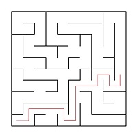
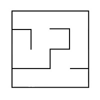

# Проект на С++ Лабиринт (Алгоритм Эллера и Ли)
##
Программа Maze, позволяющую генерировать и отрисовывать идеальные лабиринты, искать в них пути от точки до точки.
Также в программе предусмотрена кнопка для загрузки лабиринта из файла.

#
## Технологический стек
- Язык программирования: C++ стандарта C++17
- Графический пользовательский интерфейс на базе Qt(https://www.qt.io/downloadv)
- CMake (https://cmake.org/download/)

#
## Запуск проекта 
- make (используя Makefile)
#
## Запуск Unit-тестов
- make tests (используя Makefile)

#
## Требования к лабиринту
- Максимальный размер лабиринта - 50х50
- Загруженный лабиринт отрисован на экране в поле размером 500 x 500 пикселей
- Толщина "стены" - 2 пикселя
- Размер самих ячеек лабиринта вычисляется таким образом, чтобы лабиринт занимал всё отведенное под него поле


#
#
## Реализации проекта Maze

#
## Part 1. Генерация идеального лабиринта

Автоматически генерируеться идеальный лабиринта согласно **алгоритму Эллера**. Сгенерированный лабиринт может быть сохранен в файле.
(Идеальным считается лабиринт, в котором из каждой точки можно попасть в любую другую точку ровно одним способом, не имеет изолированных областей и петель).

#
## Part 2. Решение лабиринта

Показывает решение _любого_ лабиринта, который сейчас изображен на экране:
- Пользователем задаются начальная и конечная точки

#
#   
## Chapter I - Краткая информация о лабиринтах

Лабиринт с "тонкими стенками" представляет собой таблицу размером _n_ строк на _m_ столбцов. 
Между ячейками таблицы могут находиться "стены". Также "стенами" окружена вся таблица в целом. 

Далее приведён пример такого лабиринта: \


Решением лабиринта считается кратчайший путь от заданной начальной точки (ячейки таблицы) до конечной. 
При прохождении лабиринта можно передвигаться к соседним ячейкам, не отделенным "стеной" от текущей ячейки и находящимся сверху, снизу, справа или слева. 
Кратчайшим маршрут считается, если он проходит через наименьшее число ячеек.

Пример лабиринта с его решением: \


В этом примере начальная точка задана, как 10; 1, а конечная, как 6; 10.

## Описание лабиринта

Лабиринт может храниться в файле в виде количества строк и столбцов, а также двух матриц, содержащих положение вертикальных и горизонтальных стен соответственно. 
В первой матрице отображается наличие стены справа от каждой ячейки, а во второй - снизу. 

Пример подобного файла:  
```
4 4
0 0 0 1
1 0 1 1
0 1 0 1
0 0 0 1

1 0 1 0
0 0 1 0
1 1 0 1
1 1 1 1
```

Лабиринт, описанный в этом файле: \



## Недостатки лабиринтов

К недостаткам лабиринтов относятся изолированные области и петли.

Изолированная область - это часть лабиринта с проходами, в которые нельзя попасть из оставшейся части лабиринта. Например: \


Петля - это часть лабиринта с проходами, по которым можно ходить "кругами". Стены в петлях не соединены со стенами, окружающими лабиринт. Например: \
